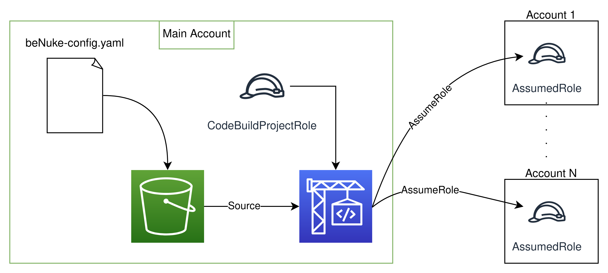

# beNuke
Super-minimal base infrastructure for running [aws-nuke](https://github.com/rebuy-de/aws-nuke) cross-account.

## Setup
1. Edit `parameters.ts` with your main account infos. If the resource names are edited, remember to also edit the parameters of the CloudFormation template in the next step
2. Deploy `stackset/assumed-role.yaml` into all the target accounts. Consider using Stackset to do so, it's very convenient
3. Deploy the CDK stack using `cdk deploy`
4. Edit the aws-nuke config file inside `bucket_content/beNuke-config.yaml` and upload it to the newly created bucket

**Optional** steps for IoT Button as trigger:

5. Set `buttonEnabled = true` inside `parameters.ts` and run `cdk deploy` again
6. In the AWS Console, go to the deployed Lambda Function (defaults to `iotNukeTrigger`) and select `Add trigger`. Select `AWS IoT` and enter the Device Serial Number written on the back of the button

## Ready to nuke?
In order to ensure that no unintentional data loss occurs, the script is intentionally left in *dry-run* mode. Also, no parameter is provided to easily switch the mode. To enable resource nuking, add `--no-dry-run` to the aws-nuke command in the BuildSpec. 
